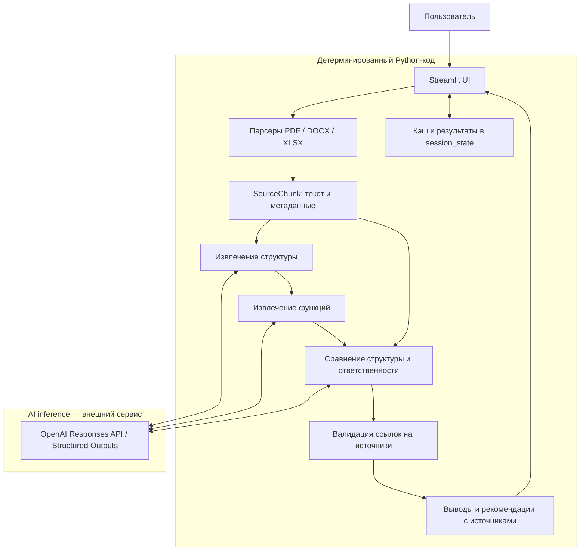

# ОргАналитик AI

AI-сервис для анализа организационной структуры и функций до и после реорганизации.
HackAlem MVP: два документа, сравнение изменений и проверяемые ссылки на исходный текст.

## Проблема

Ручное сравнение организационных документов требует сопоставлять подразделения,
обязанности и формулировки из разных редакций. При реорганизации могут возникать
потери функций, дублирование, пересечение ответственности и потенциальные конфликты
интересов. Одного текстового diff недостаточно для интерпретации таких изменений.

## Решение

Документы ДО/ПОСЛЕ → парсинг → извлечение организационной структуры → анализ функций
и ответственности → сравнение → проверка источников → потенциальные риски и рекомендации.

**«AI интерпретирует — система проверяет источники.»**

Каждый отображаемый содержательный вывод связан с исходными фрагментами документов.
Проверка ссылок выполняется при извлечении и сравнении. Она подтверждает наличие
источника, но не доказывает, что интерпретация AI верна: окончательное решение принимает человек.

## Возможности

- Загрузка документов ДО/ПОСЛЕ в PDF, DOCX и XLSX, до 20 МБ каждый.
- Извлечение структурных подразделений, поддержанных источником наименований и алиасов.
- Извлечение функций с привязкой к подтверждённым подразделениям.
- Сравнение структуры: сохранение, создание, удаление и преобразование подразделений.
- Анализ изменений и перераспределения ответственности по исходному тексту.
- Гипотезы о возможной потере функций, дублировании и конфликтах интересов; рекомендации по проверке.
- Просмотр оригинальных фрагментов, имени документа, страницы, пункта или другого указателя.
- Русский интерфейс, единый запуск анализа и сравнения с этапами прогресса.
- Раздельный кэш успешного извлечения и сравнения в текущей сессии.

## Архитектура



Узлы извлечения и сравнения — Python-оркестраторы: смысловые ответы формирует OpenAI,
а код задаёт схему, проверяет владельцев и ссылки. Валидация также выполняется после
каждого этапа извлечения, до передачи данных дальше. Подробности: [архитектура](docs/architecture.md).

## Как работает AI

| Детерминированный код | AI |
| --- | --- |
| Читает файлы и выделяет текст | Интерпретирует организационную структуру |
| Сохраняет метаданные и распознаёт номера пунктов | Выделяет обязанности и их владельцев |
| Формирует порции контекста и проверяет схемы ответов | Семантически сравнивает ответственность |
| Проверяет существование ссылок и допустимые подразделения | Формулирует гипотезы о рисках и рекомендации |
| Обслуживает кэш, состояние и интерфейс | Возвращает ссылки на предоставленные источники |

AI **не является источником доказательств**. Сначала для каждого документа извлекается
структура, затем функции с использованием полного проверенного реестра подразделений.
Должности не становятся подразделениями автоматически; обязанности руководителя могут
относиться к подразделению при явной связи в источнике.

Сравнение использует подразделения и исходные фрагменты напрямую, поэтому не ограничено
списком извлечённых функций. Кандидаты на потерю проходят дополнительную проверку переноса
на другие подразделения ПОСЛЕ. Анализ дублирования и конфликтов использует документ ПОСЛЕ.

## Traceability / Explainability

`SourceChunk` хранит `chunk_id`, `document_id`, `filename`, `page`, `section`, `locator`, `text`.
Например, `before_p006_003` — детерминированный идентификатор позиции фрагмента, который
разрешается в контексте конкретного документа. Идентификатор документа учитывает сторону,
имя файла и содержимое; один `chunk_id` не является глобальным ID всех загрузок.

Подразделения, функции и результаты сравнения ссылаются на эти фрагменты. Неизвестные
ссылки отклоняются; объекты без достаточных допустимых подтверждений не показываются
как проверенные результаты. Цитата в «Показать подтверждение» берётся из сохранённого
текста парсера, а не генерируется AI. Для DOCX/XLSX вместо номера страницы используется
абзац либо лист и строка. Номер пункта может отсутствовать.

## Tech Stack

- Python 3.10+; локальные проверки выполнены в Python 3.12.
- Streamlit — интерфейс и состояние сессии.
- PyMuPDF — PDF; python-docx — DOCX; openpyxl — XLSX.
- OpenAI Python SDK — Responses API и Structured Outputs.
- Pydantic — схемы ответов; dataclasses — внутренние модели.
- python-dotenv — чтение `.env`.
- unittest, unittest.mock и Streamlit AppTest — автоматические проверки.

Базы данных, векторного хранилища, embeddings, OCR и аутентификации нет.

## Структура проекта

```text
app.py                         # единый пользовательский сценарий
requirements.txt               # зависимости с диапазонами версий
.env.example                   # шаблон без ключа
.gitignore
.streamlit/config.toml         # тема и лимит загрузки
src/
  config.py                    # настройки из окружения и .env
  models.py                    # документы, фрагменты, результаты
  ui_common.py                 # общие элементы UI и источники
  comparison_ui.py             # вкладки результатов
  parsers/
    parser_factory.py          # проверка загрузки и выбор парсера
    pdf_parser.py
    docx_parser.py
    xlsx_parser.py
  services/
    chunking.py                # фрагменты и номера пунктов
    extraction.py              # структура, затем функции
    comparison.py              # сравнение, риски, проверка потерь
    pipeline.py                # последовательность и кэш
tests/                        # unittest и AppTest
docs/
   architecture.md
   demo.md
```

## Быстрый запуск

Нужны Python 3.10+, доступ к сети для установки пакетов и OpenAI API,
а также действующий API-ключ с доступом к выбранной модели. Команды выполняются
из корня репозитория. Реальный анализ отправляет текст в OpenAI и может быть платным.

Windows PowerShell:

```powershell
python -m venv .venv
.\.venv\Scripts\python.exe -m pip install -r requirements.txt
# Только если .env ещё не существует:
Copy-Item .env.example .env
```

В локальном `.env` укажите собственный ключ (не коммитьте его):

```dotenv
OPENAI_API_KEY=your-key-here
OPENAI_MODEL=gpt-4.1-mini
```

```powershell
.\.venv\Scripts\python.exe -m streamlit run app.py
```

macOS/Linux:

```bash
python3 -m venv .venv
.venv/bin/python -m pip install -r requirements.txt
# Только если .env ещё не существует:
cp .env.example .env
# Заполните .env своим ключом перед анализом.
.venv/bin/python -m streamlit run app.py
```

Откройте адрес, выведенный Streamlit, обычно `http://localhost:8501`.
Активация виртуального окружения не требуется: команды используют его Python напрямую.

## Переменные окружения

| Переменная | Назначение | Значение по умолчанию |
| --- | --- | --- |
| `OPENAI_API_KEY` | Ключ доступа к OpenAI; необходим для запуска анализа | Нет |
| `OPENAI_MODEL` | Модель с поддержкой используемых структурированных ответов | `gpt-4.1-mini` |

Переменные процесса имеют приоритет над `.env` в корне репозитория. Настройки читаются
при явном запуске анализа. При отсутствии ключа интерфейс сообщает об ошибке настройки.

## Поддерживаемые форматы

| Формат | Что извлекается | Ограничения |
| --- | --- | --- |
| PDF | Текст страниц с разделением по распознанным номерам пунктов | Нет OCR; PDF с паролем не поддерживается; порядок текста зависит от вёрстки |
| DOCX | Непустые абзацы тела документа с физическими индексами | Таблицы, колонтитулы, текстовые поля и автоматические номера списков не извлекаются |
| XLSX | Непустые строки, лист, номер строки и буквы столбцов | Формулы сохраняются как текст, не вычисляются |

Пустые, повреждённые, неподдерживаемые файлы и файлы свыше 20 МБ отклоняются.
В смешанном PDF страницы без доступного текстового слоя не анализируются.

## Сценарий проверки

1. Запустите приложение.
2. Загрузите исходный документ в «До реорганизации».
3. Загрузите новую редакцию в «После реорганизации».
4. Нажмите «Провести анализ».
5. Дождитесь этапов чтения, определения структуры и функций, сравнения, формирования рисков и рекомендаций.
6. В «Результаты сравнения» изучите вкладку «ОБЗОР ИЗМЕНЕНИЙ».
7. Откройте «ИЗМЕНЕНИЯ ФУНКЦИЙ» и проверьте перераспределение ответственности.
8. На вкладке «РИСКИ И РЕКОМЕНДАЦИИ» изучите карточки найденных гипотез, если они есть.
9. Раскройте «Показать подтверждение».
10. Сверьте документ, страницу/локатор, пункт и исходный фрагмент с выводом.

Повторите запуск с той же парой в той же сессии: завершённые этапы берутся из кэша
без повторных запросов. Ключ включает хеши обоих файлов, исходные имена, модель,
версии обработки и отпечатки файлов реализации. Хранятся до трёх пар на каждый кэш;
переименование файла тоже вызывает новый анализ, чтобы не перепутать источники.
Обычные rerun интерфейса не повторяют запросы. Ошибки не кэшируются; после сбоя
сравнения успешное извлечение сохраняется и используется при повторной попытке.

[Сценарий демонстрации на 3 минуты](docs/demo.md).

## Тестирование

Windows:

```powershell
.\.venv\Scripts\python.exe -m unittest discover -s tests -v
```

macOS/Linux:

```bash
.venv/bin/python -m unittest discover -s tests -v
```

Финальный локальный прогон 23.09.2026: **81 тест, все прошли**, Python 3.12,
существующее изолированное окружение `.venv-h2`. Проверены парсеры на генерируемых
PDF/DOCX/XLSX, проверки источников, роли и алиасы, принадлежность функций, сравнение,
обработка ошибок, русский UI, кэш и сохранение результатов при rerun.
OpenAI в тестах замокан: API-кредиты не расходуются. Эти тесты не доказывают качество
реального анализа редакций 8/9 и не измеряют его скорость.

Дополнительно проверены импорт `app.py`, запуск Streamlit и ответ `ok` на health endpoint,
соответствие установленных версий `requirements.txt` и `pip check` без конфликтов.
Локальная среда: Python 3.12.14, Streamlit 1.64.0, PyMuPDF 1.28.2, python-docx 1.2.0,
openpyxl 3.1.5, openai 2.54.0, python-dotenv 1.2.3, Pydantic 2.13.5.
Чистая установка в новое окружение и запуск на macOS/Linux в этой проверке не выполнялись.
Команды сверены с путями и точкой входа проекта; Mermaid проверен по структуре текста,
без отдельного рендерера диаграмм. Реальные запросы OpenAI в финальной QA не выполнялись.

## Ограничения

- Выводы AI требуют проверки человеком; вероятные риски — гипотезы, не юридические заключения.
- Первый анализ может занимать несколько минут. Фиксированное время ответа не гарантируется.
- Кэш локален для сессии и теряется при новой сессии или перезапуске сервера; общего дискового кэша нет.
- Точность зависит от структуры, качества текста и однозначности описания ответственности.
- Извлечение выполняется порциями контекста; дальние связи и семантические дубликаты могут быть пропущены.
- Для больших документов сравнение использует выбранные исходные фрагменты — до 65 000 UTF-8 байт на сторону.
  При неполном покрытии ПОСЛЕ выводы о потере скрываются. Чрезмерный контекст может привести к отказу обработки.
- Нет экспорта отчётов, БД и управления пользователями. MVP рассчитан на доверенные локальные документы.
- Зависимости заданы диапазонами, без lock-файла; побитовая воспроизводимость окружения не гарантируется.

## Безопасность

Ключ хранится в переменных окружения или локальном `.env`, который игнорируется Git.
`.env.example` содержит пустой `OPENAI_API_KEY`; реальный ключ в репозиторий добавлять нельзя.
Проверка текущих отслеживаемых файлов на распространённые признаки ключей и секретов
не выявила совпадений; это не полный аудит истории Git или безопасности приложения.

Для inference исходный текст и организационные данные передаются в OpenAI; используйте
документы, которые разрешено обрабатывать таким способом. Вызовы используют `store=False`;
это не заявление о полной политике хранения внешнего сервиса. Кэш и результаты находятся
в памяти сессии. Ссылки доказательств проверяются по распарсенным источникам, а показываемый
текст берётся из них напрямую. Аутентификация не реализована: не публикуйте локальный MVP
как открытый многопользовательский сервис без отдельной доработки безопасности.
