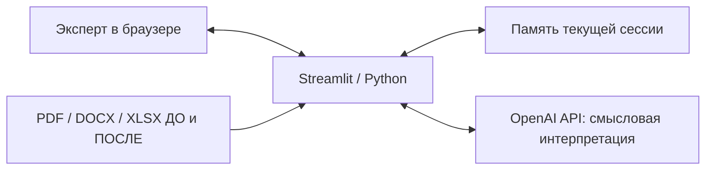
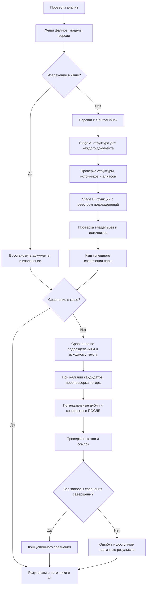

# Архитектура ОргАналитик AI

## Контекст системы

Локальное Streamlit-приложение помогает эксперту сравнить организационные документы
ДО/ПОСЛЕ. Python-процесс читает файлы, вызывает внешний OpenAI API и показывает результаты.
Пользователь проверяет гипотезы по исходному тексту. БД, векторного поиска, фоновой очереди,
аутентификации и экспорта отчётов нет. Текст документов передаётся внешнему сервису.

## Компоненты и ответственность

| Компонент | Ответственность |
| --- | --- |
| `app.py` | Загрузка, единый запуск, этапы прогресса, блокировка повторного нажатия, отображение ошибок |
| `src/config.py` | `.env` и окружение, проверка ключа, выбор модели |
| `src/parsers/` | Проверка размера/формата, извлечение текста, создание документа |
| `src/services/chunking.py` | Детерминированные фрагменты и распознавание номера пункта |
| `src/models.py` | Dataclasses документов и результатов; Pydantic-схемы сравнения |
| `src/services/extraction.py` | Порции источников, структура, алиасы, функции, валидация владельцев и ссылок |
| `src/services/comparison.py` | Выбор контекста, сравнение, перепроверка потерь, риски и проверка результатов |
| `src/services/pipeline.py` | Последовательный запуск и два кэша успешных результатов |
| `src/ui_common.py`, `src/comparison_ui.py` | Русские подписи, вкладки, карточки и оригинальные подтверждения |

## Pipeline

Схема показывает основной успешный путь; при ошибках сравнения независимый проход
по рискам может продолжиться, а уже полученные данные сохраняются. Валидация выполняется
после каждого ответа, а не только в конце. Сравнение автоматически следует за извлечением:
отдельной кнопки сравнения нет. В UI показаны чтение, структура/функции, сравнение и риски/рекомендации.

### Извлечение

Для каждого документа все порции исходного текста сначала проходят Stage A (структура).
Код исключает неподтверждённые роли и нормализует поддержанные источником алиасы.
Stage B повторно обрабатывает порции с полным проверенным реестром подразделений;
создать новое подразделение на этом этапе нельзя. Функция должна иметь допустимого
владельца и доказательства его связи с обязанностью. Явные обязанности директора
подразделения могут быть функциями подразделения, но должность сама по себе не становится OrgUnit.

Размер порции — до 24 000 UTF-8 байт, с перекрытием в один фрагмент. Большой фрагмент
может передаваться частями, сохраняя исходный ID. Реестр Stage B ограничен 24 000 байтами;
превышение приводит к ошибке, а не скрытому удалению подразделений. Отказ модели,
неполный ответ или ошибка запроса не дают записать пару в кэш извлечения.

### Сравнение

Сравнение получает проверенные подразделения и исходные SourceChunk напрямую, а не только
извлечённые функции. Выборка приоритетно включает ссылки подразделений, упоминания имён
и алиасов, соседние фрагменты и связанные разделы; лимит — 65 000 байт на сторону.

Основной проход определяет изменения структуры и ответственности. Если есть кандидаты
на потерю, дополнительный проход ищет перенос на другие подразделения ПОСЛЕ. При
неполном покрытии ПОСЛЕ или неудачной перепроверке гипотезы потерь скрываются.
Отдельный проход анализирует возможные дубли и конфликты интересов в ПОСЛЕ.
Отброшенные неподтверждённые кандидаты не означают технический сбой всего запроса.

## AI и детерминированная логика

AI выполняет организационную интерпретацию, выделение обязанностей, семантическое
сопоставление, рассуждение о рисках и формулирование рекомендаций. OpenAI Python SDK
использует Responses API, `responses.parse`, Pydantic Structured Outputs и `store=False`.
Таймаут запроса — 90 секунд, допустим один retry SDK: суммарный запуск может быть значительно дольше.

Код читает файлы, создаёт ID и метаданные, готовит контекст, проверяет схемы и ссылки,
нормализует часть названий/дубликатов, управляет кэшем и UI. Он не доказывает смысловую
истинность вывода модели. Confidence — оценка модели, не калиброванная вероятность.

## Источники и объяснимость

`Document`: ID, сторона, оригинальное имя файла, формат и список фрагментов.
`SourceChunk`: ID фрагмента и документа, оригинальное имя, страница, пункт, locator и текст.
ID документа включает SHA-256 имени и содержимого; ID фрагмента описывает позицию внутри
документа и сторону. Такие ID стабильны в пределах анализа, но не глобально уникальны между загрузками.

PDF сохраняет текст страниц с разделением по обнаруженным номерам пунктов. DOCX хранит
физический индекс абзаца, XLSX — лист и строку с буквами столбцов. Для DOCX/XLSX страница
отсутствует, а `locator` позволяет найти источник. Пункт может быть `null`.

OrgUnit и Function ссылаются на исходные `chunk_id`. Сравнение хранит ссылки отдельно для
сторон ДО/ПОСЛЕ; выводы по рискам могут опираться только на ПОСЛЕ. Код разрешает ссылки
по реально переданным фрагментам и проверяет допустимых владельцев. Неизвестные ссылки
отбрасываются; результаты без необходимых подтверждений не проходят валидацию.
UI получает цитату из сохранённого SourceChunk, а не из придуманного моделью текста.
Это гарантирует прослеживаемость, но не корректность причинно-следственной интерпретации.

## Кэш и состояние сессии

- `_analysis_cache`: успешное извлечение всей пары вместе с распарсенными документами.
- `_comparison_cache`: сравнение с `completed=True` после успешных обязательных проходов,
  включая перепроверку потерь, если она требовалась.
- Ключ извлечения: стороны, SHA-256 содержимого обоих файлов, оригинальные имена,
  модель, явная версия и отпечатки файлов моделей данных, парсеров, chunking, extraction и requirements.
- Ключ сравнения: ключ извлечения, версия сравнения и отпечаток его реализации.
- Каждый кэш ограничен тремя парами; старейшая запись вытесняется. При записи и чтении
  используется deepcopy, чтобы изменение отображаемого объекта не повредило кэш.
- Секрет API не входит в ключ или значение кэша. Текст документов и результаты содержатся в памяти.
- `documents`, `extractions`, `comparison` — текущие результаты в `st.session_state`.
  Смена загрузки очищает отображаемые результаты, но не кэши. Явный запуск может восстановить их.
- Обычный rerun не запускает inference. Во время обработки кнопка и загрузки отключены.
- Кэш не общий для пользователей, не дисковый и теряется при новой сессии/рестарте сервера.
  Переименование документа вызывает промах кэша ради корректности имён в подтверждениях.

## Обработка ошибок

Парсер отклоняет неподдерживаемые, пустые, слишком большие, повреждённые документы и
документы без доступного текста. Отсутствие ключа и сбои анализа отображаются по-русски.
Ключи и исходные тексты ошибок внешнего сервиса не показываются пользователю как диагностика.

Неуспешное извлечение пары не кэшируется. Если сравнение завершилось частично, UI показывает
предупреждения и доступные результаты; такое сравнение не кэшируется. Уже завершённое
извлечение остаётся в памяти, поэтому повторная кнопка запуска повторяет сравнение без
новых запросов извлечения. При ошибке одного документа первая успешно обработанная
сторона отдельно не кэшируется: единицей кэша извлечения является пара.

## Известные ограничения

Это прототип поддержки принятия решений: AI формирует гипотезы и рекомендации.
Итоговые организационные выводы проверяет ответственный сотрудник по оригинальным документам.

Первый анализ реальных документов может занимать несколько минут; в одном реальном тесте
он превысил 7 минут. Длительность зависит от размера и структуры документов, количества
выделенных разделов, числа этапов AI-анализа и задержек OpenAI API/сети. Максимальное время
не гарантируется. Успешные результаты кэшируются только в текущей Streamlit-сессии:
повторный анализ той же пары в ней может быть быстрее, но после новой сессии или рестарта
сервера постоянного кэша для повторного использования нет.

LLM-извлечение вариативно: новые AI-запуски на одинаковых документах могут возвращать
разное количество кандидатов в подразделения и функции. Проверка доказательств и покрытия
не делает AI-ответ детерминированным и не гарантирует смысловую полноту результатов.

Если подразделения не удалось уверенно сопоставить, UI предупреждает о частичном анализе
и сохраняет подтверждённые результаты; пропущенные сопоставления не означают «ноль изменений».
При неполном контексте ПОСЛЕ гипотезы о потенциальной потере функций могут быть скрыты.

Нет OCR; DOCX-парсер не читает таблицы и колонтитулы; XLSX не вычисляет формулы.
Порции и выборка контекста могут пропустить дальние связи, а интерпретация зависит от
структуры документа. Семантические дубли и неоднозначная ответственность могут остаться.
Риски — гипотезы для проверки человеком, не юридические выводы. Нет постоянного хранения,
управления доступом и отчётов. Зависимости ограничены диапазонами, без lock-файла.

## Дальнейшее развитие

Возможные направления, **пока не реализованные**: асинхронная/фоновая обработка,
постоянный кэш результатов, оптимизация порций и выбора контекста, предварительное
детерминированное сопоставление точных имён/алиасов подразделений, оценка модели
на размеченном контрольном наборе и мониторинг качества извлечения и задержек.

Проверки и запуск описаны в [README](../README.md); демонстрация — в [demo.md](demo.md).
